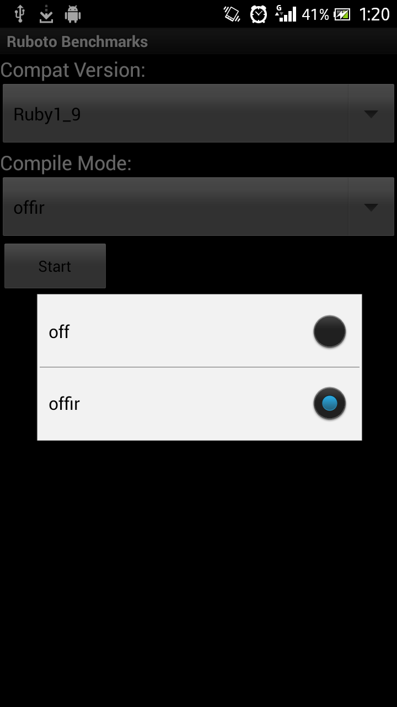

<h2>Table of Contents</h2>

<ul>
<li><a href="#sec-1">1. Ruboto Benchmark Client</a>
<ul>
<li><a href="#sec-1-1">1.1. Modify the app for detailed JRuby benchmark</a>
<ul>
<li><a href="#sec-1-1-1">1.1.1. Change the layout</a></li>
</ul>
</li>
<li><a href="#sec-1-2">1.2. Create a spinner for reporting all benchmarks</a></li>
<li><a href="#sec-1-3">1.3. Make the starting mode predictable</a>
<ul>
<li><a href="#sec-1-3-1">1.3.1. Rely on something predictable</a></li>
<li><a href="#sec-1-3-2">1.3.2. Set it before JRuby initializing</a></li>
</ul>
</li>
<li><a href="#sec-1-4">1.4. Notice</a>
<ul>
<li><a href="#sec-1-4-1">1.4.1. Do not run 'require <b>**</b>' benchmarks under Ruby1.8 mode</a></li>
<li><a href="#sec-1-4-2">1.4.2. Do not try Ruby2.0 while using JRuby.jar</a></li>
</ul>
</li>
</ul>
</li>
</ul>

# Ruboto Benchmark Client

We have had a benchmark tool [Ruboto Benchmark Client](https://github.com/ruboto/ruboto_benchmark_client) running on Android devices, you can directly download it from Google Play.

## Modify the app for detailed JRuby benchmark

Last time, I've customized a new jruby with a map storing the loading times of jruby libraries. What we need to do now is to change the layout to reflect the new feature of `org.jruby.runtime.load.LoadService.loadTimes`.

### Change the layout

Add a button for jruby loading details. Temporarily use a toast to display the JRuby lib loading details. As there're quite too many entries to display. Maybe we can find a better solution.

    button :id => 57, :text => 'JRuby Libs', :text_size => button_size, :layout => button_layout,
           :on_click_listener => proc { 
    jruby_benchmark = ""
    LoadService.loadTimes.each do |k,v|
      jruby_benchmark += k + " " + v.to_s + "ms\n"
    end
    toast jruby_benchmark

## Create a spinner for reporting all benchmarks

Modify the code of button "Report" to provide a function to report all measurements already exist. Now, there's a problem that the code of open the benchmark webpage is written in `Report#send_report`. I'm going to divide it into `send_report` & `view_results` so that the browser would be opened after all benchmarks been reported.

    report_benchmarks = {
      'Report' => proc{},
      'Report single benchmark' => proc{
        Report.send_report self, @benchmark_view.selected_view.text, $benchmarks[@benchmark_view.selected_view.text]
      },
      'Report all benchmarks' => proc{
        toast "Running all benchmarks"
        # Jump over Ruby1_8 benchmarks of 'require something', sometimes crash
        benchmarks.each do |k,v| 
          next if System.getProperty('jruby.compat.version').capitalize == "Ruby1_8" && k =~ /require \w+/
          benchmark(k, v , TRUE)
          Report.send_report self, k, $benchmarks[k]
        end
      }
    }

Note that some of the benchmarks will be automatically jumped over in Ruby18 mode as it's currently unstable. I'll check it later.

## Make the starting mode predictable

We can see that RBC now starts randomly in different compile modes and compat versions. About how to make the starting mode predictable, I've got 2 plans.

    System.setProperty("jruby.compile.mode", new String[]{"OFF", "OFFIR"}[((int) (Math.random() * 2))]);
    System.setProperty("jruby.compat.version", new String[]{"RUBY1_8", "RUBY1_9", "RUBY2_0"}[((int) (Math.random() * 3))]);

### Rely on something predictable

One of the predictable stuff could be something like the total running times. So that we can easily implenment it with a simple file recording the running times. Just simply change the code `((int) (Math.random() * 2))` into `running_times%2` would be okay. After that, increase the number by 1.

### Set it before JRuby initializing

Now, a Ruboto app starts in `org.ruboto.EntryPointActivity`. What we need to do is adding another activity which runs before it to set the starting mode manually. Here's the code [SetModeActivity.java](https://github.com/Nyangawa/ruboto_benchmark_client/blob/master/src/org/ruboto/benchmarks/SetModeActivity.java). //

## Notice

### Do not run 'require **\*\***' benchmarks under Ruby1.8 mode

It will simply crash with JRuby1.7.4.jar. This bug should be fixed soon.

### Do not try Ruby2.0 while using JRuby.jar

If you use Ruboto-core, it should be running normally. I'll check it soon in with jruby wiki.
